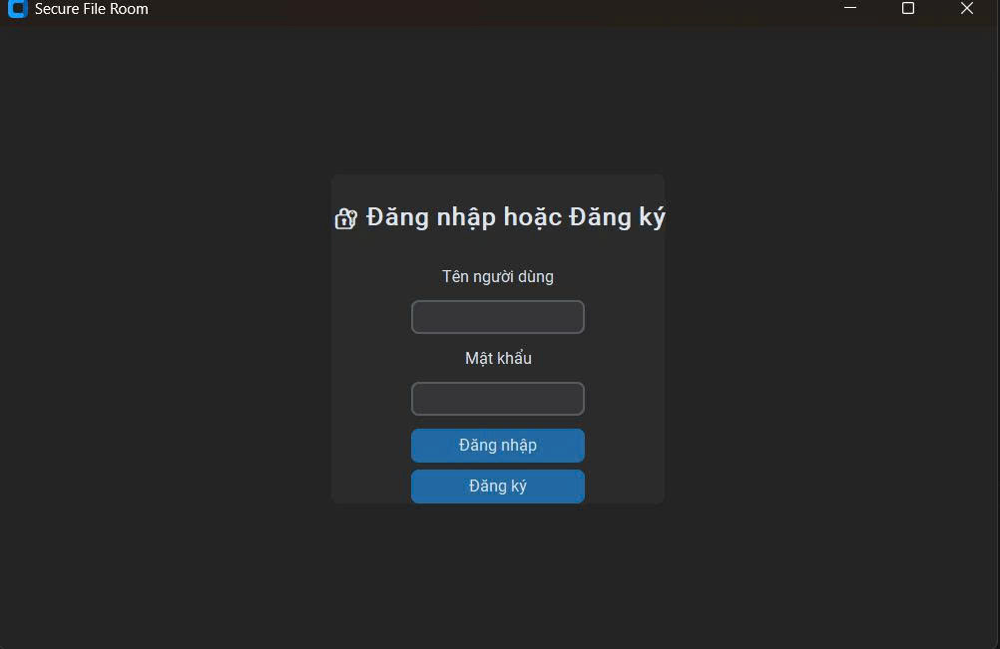
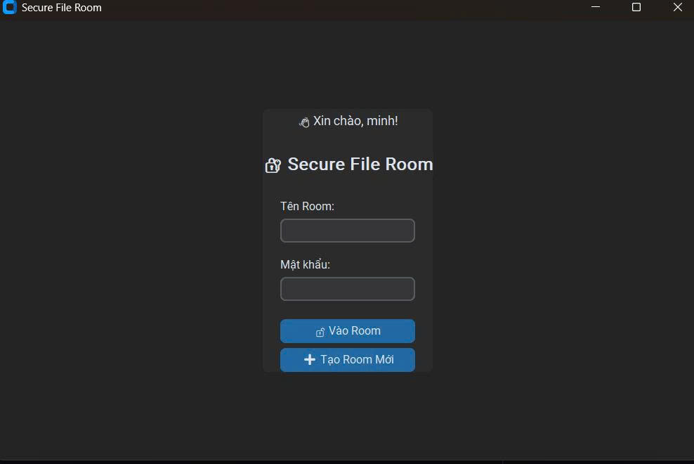
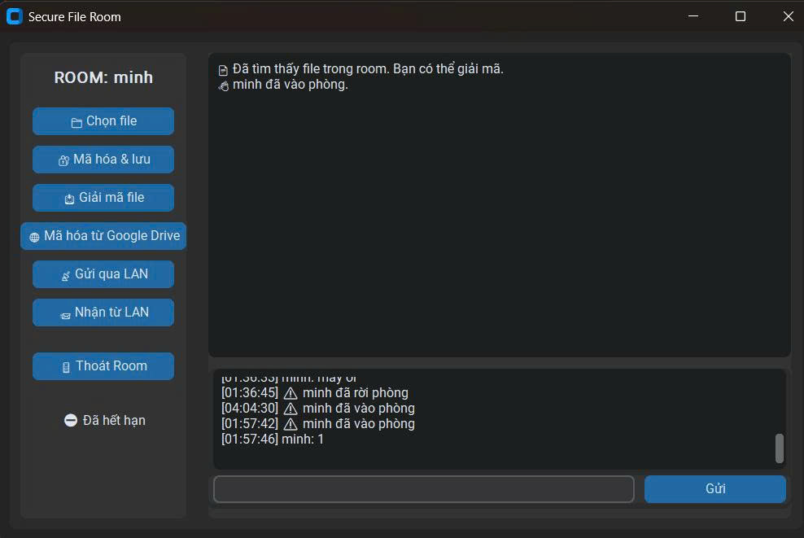

<p align="center">
  
</p>
# 📁 ATBMTT – Truyền File Email An Toàn Có Giới Hạn Thời Gian

**Bài tập lớn môn An toàn, Bảo mật Thông tin**
**Đề tài:** Gửi tài liệu email có giới hạn thời gian, chỉ cho phép mở trong vòng 24 giờ sau khi gửi.

---

## 🚀 Mục Tiêu Đề Tài

Xây dựng chương trình truyền file **an toàn** giữa hai máy, với các tiêu chí:

* 🔒 Mã hóa nội dung file bằng **AES-CBC**
* 🔐 Bảo mật khóa AES bằng **RSA 2048-bit**
* ✅ Xác minh tính toàn vẹn bằng **SHA-512**
* ⏳ Giới hạn thời gian mở file: chỉ trong **24 giờ** kể từ thời điểm gửi

---

## 🤩 Kiến Trúc Hệ Thống

```
ATBMTT/
├── gui_app.py               # Giao diện người gửi (GUI)
├── server.py                # Server phía nhận
├── keys/
│   ├── generate_keys.py     # Tạo cặp khóa RSA
│   ├── sender_private.pem
│   ├── sender_public.pem
│   ├── receiver_private.pem
│   └── receiver_public.pem
├── rooms/                   # Thư mục chứa file sau giải mã
├── received_packets/        # Gói tin nhận được từ bên gửi
├── img/
│   └── f.png                # Ảnh minh họạ giao diện
└── README.md                # Hướng dẫn sử dụng
```

---

## 🔐 Quy Trình Mã Hóa & Giải Mã

### 📨 BÊN GỬI

1. **Handshake**:

   * Gửi `"Hello!"`, nhận `"Ready!"`

2. **Trao đổi khóa & ký số**:

   * Tạo `metadata = filename + timestamp`
   * Ký `metadata` bằng **RSA + SHA-512**
   * Sinh **session\_key (AES)** ngẫu nhiên
   * Mã hóa `session_key` bằng **RSA public key của người nhận**

3. **Mã hóa nội dung**:

   * Sinh **IV**
   * Mã hóa file bằng **AES-CBC (session\_key, IV)**
   * Tính `expiration = timestamp + 24 giờ`
   * Tính `hash = SHA512(IV + cipher + expiration)`
   * Gửi gói tin:

```json
{
  "iv": "<Base64>",
  "cipher": "<Base64>",
  "hash": "<hex>",
  "sig": "<RSA signature>",
  "exp": "2025-04-23T09:00:00Z"
}
```

---

### 📅 BÊN NHẬN

* Giải mã `session_key` bằng **RSA private key**
* Kiểm tra:

  * ✅ **Hash trùng khớp**
  * ✅ **Chữ ký hợp lệ**
  * ✅ **Chưa hết hạn**
* Nếu hợp lệ:

  * Giải mã `cipher` → Lưu file `email.txt`
  * Gửi `"ACK"`
* Nếu không hợp lệ:

  * Gửi `"NACK"` kèm lý do (`timeout`, `hash mismatch`, `signature error`)

---

## 🛡️ Bảo Mật & Công Nghệ Áp Dụng

| Thành phần         | Công nghệ sử dụng                   |
| ------------------ | ----------------------------------- |
| Mã hóa dữ liệu     | AES-CBC 256-bit                     |
| Ký số & xác thực   | RSA 2048-bit + SHA-512              |
| Toàn vẹn dữ liệu   | SHA-512                             |
| Giới hạn thời gian | Timestamp + ISO 8601 + kiểm tra exp |

---

## 🥪 Sinh Khóa RSA

```bash
python keys/generate_keys.py
```

Tạo 4 file:

* `sender_private.pem`, `sender_public.pem`
* `receiver_private.pem`, `receiver_public.pem`

---

## 💻 Hướng Dẫn Sử Dụng

### 1. Chạy Giao Diện (máy nhận)

```bash
python gui_app.py
```

### 2. Chạy Giao Diện Người Gửi

```bash
python gui_app.py
```

### 3. Gửi file

* Chọn file cần gửi
* Nhập thời hạn hiệu lực (mặc định: 24 giờ)
* Nhấn **"Send"**

### 4. Gửi qua LAN

* Ở client máy nhận chọn nhận từ LAN
* Ở client máy gửi chọn gửi qua LAN và nhập ip của máy nhận (2 máy phải cùng mạng LAN)
* Sau khi hoàn tất file sẽ tự động giải mã và lưu về folder

### 5. Mã hóa từ drive

* Nhập link GG drive cần mã hóa (Link phải được công khai)
* Sau khi hoàn tất sẽ tự động tải file trên drive về và mã hóa 

---

## 🖼️ Giao Diện Người Dùng

> 📌 Hình ảnh minh họạ GUI:





---

## 📝 Ghi Chú

* 📟 **Gói tin đã gửi** được lưu trong thư mục `received_packets/`
* 📅 **File giải mã** được lưu tại `rooms/`
* ⛔ Nếu quá hạn, file sẽ **không được giải mã**
* 🔐 Hệ thống **tự động sinh session\_key và IV** – **không cần nhập tay**

---

## 📚 Công Nghệ Sử Dụng

* `PyCryptodome`: AES, RSA, SHA-512
* `socket`: Kết nối mạng giữa máy gửi – nhận
* `tkinter`: Giao diện GUI
* `datetime`, `base64`, `json`: Xử lý thời gian và dữ liệu
* `os`, `hashlib`: Mã hóa và kiểm tra toàn vẹn

---

## 🧑‍💻 Tác Giả

* **Họ tên:** Ngô Tuấn Minh
* **MSSV:** 1571020175
* **Lớp:** Công Nghệ Thông Tin - 16-06

---

## 📌 License


---
