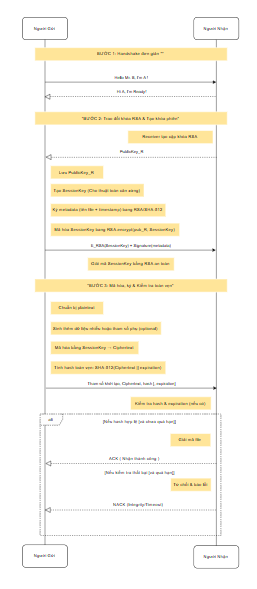

  

📁 ATBMTT - Gửi tài liệu email có giới hạn thời gian
Bài tập lớn môn An toàn, Bảo mật Thông tin

🚀 Mục Tiêu Đề Tài
Xây dựng chương trình truyền file an toàn từ máy gửi tới máy nhận, đảm bảo:

Bảo mật nội dung file với AES-CBC

Xác thực & bảo toàn khóa bằng RSA 2048-bit

Xác minh toàn vẹn bằng SHA-512

Giới hạn thời gian truy cập: chỉ mở file trong vòng 24 giờ sau khi gửi

🧩 Kiến Trúc Hệ Thống
css
Sao chép
Chỉnh sửa
ATBMTT/
│
├── gui_app.py               # Giao diện người dùng (GUI)
├── server.py                # Server chờ nhận file
├── rooms/                   # Thư mục lưu các session & kết quả giải mã
├── received_packets/        # Gói tin đã nhận
├── keys/
│   ├── generate_keys.py     # Sinh cặp khóa RSA
│   ├── sender_private.pem   # Khóa riêng người gửi
│   ├── sender_public.pem    # Khóa công khai người gửi
│   ├── receiver_private.pem # Khóa riêng người nhận
│   └── receiver_public.pem  # Khóa công khai người nhận
├── img/
│   └── f.png                # Ảnh minh họa giao diện
└── README.md                # Tài liệu hướng dẫn
🔐 Mô-đun Mã Hóa & Giải Mã
✅ Bên Gửi
Handshake:

Gửi "Hello!", chờ nhận "Ready!"

Trao đổi khóa & xác thực:

Tạo metadata = filename + timestamp

Ký metadata bằng RSA/SHA-512

Sinh session key (AES) ngẫu nhiên

Mã hóa session_key bằng khóa công khai của người nhận (RSA PKCS#1 v1.5)

Mã hóa file:

Sinh IV

Mã hóa file bằng AES-CBC với session_key

Tạo expiration = 24 giờ kể từ timestamp

Tính hash = SHA512(IV + cipher + expiration)

Tạo gói tin gửi đi:

json
Sao chép
Chỉnh sửa
{
  "iv": "<Base64>",
  "cipher": "<Base64>",
  "hash": "<hex>",
  "sig": "<RSA signature>",
  "exp": "2025-04-23T09:00:00Z"
}
✅ Bên Nhận
Nhận gói tin, giải mã session_key bằng RSA private key

Xác minh:

hash khớp?

chữ ký hợp lệ?

expiration còn hiệu lực?

Nếu hợp lệ:

Giải mã cipher bằng AES-CBC

Lưu email.txt

Gửi "ACK" xác nhận

Nếu không hợp lệ:

Gửi "NACK" kèm lý do (timeout / hash mismatch / sig error)

🛡️ Bảo Mật & Xác Thực
Thành phần	Công nghệ
Mã hóa nội dung	AES-CBC 256-bit
Xác thực & chữ ký	RSA 2048-bit + SHA-512
Trao khóa	RSA public-key
Toàn vẹn dữ liệu	SHA-512
Giới hạn thời gian	Timestamp + Expiry

🧪 Sinh Khóa RSA
Chạy:

bash
Sao chép
Chỉnh sửa
python keys/generate_keys.py
Tạo 4 file:

sender_private.pem

sender_public.pem

receiver_private.pem

receiver_public.pem

🖼️ Giao Diện Người Dùng

💻 Hướng Dẫn Sử Dụng
1. Chạy Server Nhận File
bash
Sao chép
Chỉnh sửa
python server.py
2. Chạy Giao Diện Gửi File
bash
Sao chép
Chỉnh sửa
python gui_app.py
Chọn file cần gửi

Nhập thời gian hết hạn (mặc định 24h)

Bấm "Send"

📝 Ghi Chú
Tất cả gói tin được lưu lại tại thư mục received_packets/

File giải mã được lưu vào thư mục rooms/

Nếu hết hạn, file không được giải mã.

